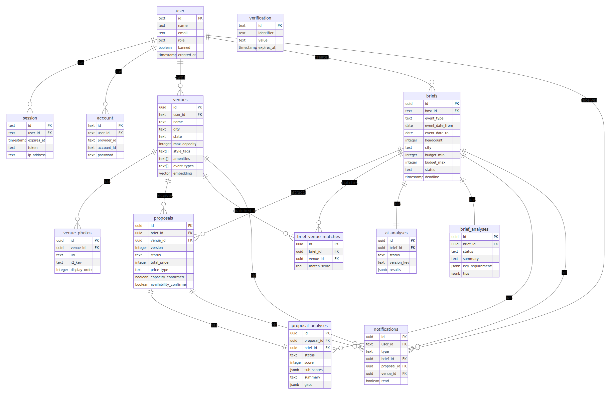

# EventBid

EventBid is a web platform for structured event venue discovery. Hosts create event briefs, matching venues submit standardized proposals, and hosts compare options, review AI-assisted analysis, and lock one winning proposal.

The product is built around one core workflow:

```text
host brief -> venue matching -> structured proposals -> AI analysis -> side-by-side comparison -> deal lock
```

## What EventBid Solves

Planning a personal event usually means scattered WhatsApp threads, PDFs, calls, and proposals that cannot be compared cleanly. EventBid turns that process into a single structured flow:

- Hosts describe the event once as a structured brief.
- Venues receive relevant, qualified opportunities.
- Proposals use a consistent format across price, capacity, inclusions, catering, amenities, availability, and pitch.
- Hosts compare proposals in one place.
- AI highlights fit, gaps, and decision points.
- Accepting a proposal atomically closes the brief and marks every other proposal as closed.

## Main Features

- Host and venue-rep registration with role selection.
- Host brief creation, editing, closing, and deletion.
- AI brief quality checks and streamed description improvement.
- Venue profile management with photos, style tags, amenities, event types, and capacity.
- Venue matching using hard filters and embedding-assisted soft matching.
- Venue brief feed for matched opportunities.
- Structured proposal submission and revision.
- Immutable proposal versioning through superseded proposal records.
- Per-proposal AI analysis with scores, summaries, and gaps.
- Brief-level proposal analysis for host comparison.
- Venue-facing "how to win" guide for matched briefs.
- Atomic deal locking when a host accepts a proposal.
- Real-time notifications through Server-Sent Events.
- Background jobs for matching, analysis, emails, deadlines, and embeddings.
- Email notifications rendered with React Email and delivered through Resend.
- Venue photo uploads through the storage adapter.

## Tech Stack

| Area | Technology |
| --- | --- |
| Monorepo | pnpm workspaces |
| Frontend | TanStack Start, React 19, TanStack Router, TanStack Query |
| Styling | Tailwind CSS 4, shadcn-style UI components, Base UI/Radix primitives |
| Backend | Hono on Node.js |
| Database | PostgreSQL, Drizzle ORM, pgvector |
| Auth | Better Auth with Drizzle adapter |
| Jobs | BullMQ |
| Redis | ioredis-compatible Redis or Upstash Redis TCP URL |
| AI | Vercel AI SDK through configurable gateway/model env vars |
| Email | Resend, React Email |
| Storage | Cloudinary adapter in the current codebase |
| Validation | Zod |
| Logging | Pino via `@eventbid/logger` |
| Language | TypeScript |

## Architecture


The backend is organized around clear boundaries:

- Repositories are the only layer that should query Drizzle/SQL directly.
- Services contain domain behavior such as matching, deal locking, analysis, notifications, and embeddings.
- Adapters isolate external systems such as AI providers, queues, email, storage, and realtime delivery.
- Jobs handle async work that should not block request/response paths.
- Shared schemas and types keep the frontend and backend API contract aligned.

## Repository Structure

```text
eventBid/
├── apps/
│   ├── web/                 # TanStack Start frontend
│   └── server/              # Hono API, jobs, DB, adapters, services
├── packages/
│   ├── shared/              # Shared Zod schemas, types, constants
│   ├── email/               # React Email templates
│   └── logger/              # Browser and Node logger helpers
├── eventbid-product-scope.md
├── eventbid-architecture.md
├── EventBid-architecture-design.svg
├── ER-diagram.svg
├── pnpm-workspace.yaml
├── package.json
└── tsconfig.base.json
```

## Applications and Packages

### `apps/web`

The frontend is a TanStack Start app. It contains:

- Public landing, login, register, and onboarding routes.
- Host dashboard and brief flows.
- Venue dashboard, brief feed, profile, and proposal flows.
- Notification UI backed by SSE invalidation hooks.
- API client wrappers in `src/server` and `src/lib`.
- Shared UI primitives in `src/components/ui`.

### `apps/server`

The backend is a Hono API server. It contains:

- Route modules for auth, briefs, proposals, venues, notifications, analysis, and SSE.
- Drizzle schema, migrations, and repository classes.
- Service classes for matching, AI analysis, brief assistance, proposal analysis, notifications, embeddings, and deal locking.
- Adapter interfaces and implementations for AI, queue, email, storage, and notifier concerns.
- BullMQ job registry, engine, and handlers.

### `packages/shared`

Shared API contracts:

- Zod request schemas.
- Domain types.
- Event type and amenity constants.

### `packages/email`

Typed React Email templates for:

- Welcome emails.
- New brief matches.
- Proposal accepted emails.
- Brief closed emails.
- Brief expired emails.
- Deadline reminders.

### `packages/logger`

Small shared logging package that exports Node and browser logger implementations.

## Prerequisites

- Node.js 20 or newer.
- pnpm 10.33.0, as declared in `package.json`.
- PostgreSQL with the `pgvector` extension available.
- Redis for BullMQ jobs and rate limiting.
- Accounts/API keys for the external services used by your environment:
  - AI gateway/provider.
  - Resend.
  - Google OAuth.
  - Cloudinary.

## Local Setup

Install dependencies:

```bash
pnpm install
```

Create environment files:

```bash
cp apps/server/.env.example apps/server/.env
cp apps/web/.env.example apps/web/.env
```

Update `apps/server/.env` with your local database, Redis, auth, AI, email, and storage credentials.

Important: keep the frontend API URL aligned with the server port. For example, if the server has:

```env
PORT=3000
```

then the web app should use:

```env
VITE_API_URL=http://localhost:3000
```

The checked-in examples currently use different ports, so adjust one of them before running both apps.

Start PostgreSQL and Redis locally. One common Redis command is:

```bash
docker run --name eventbid-redis -p 6379:6379 -d redis:7
```

Create or migrate the database:

```bash
pnpm db:migrate
```

Run both apps:

```bash
pnpm dev
```

Or run them separately:

```bash
pnpm dev:server
pnpm dev:web
```

## Environment Variables

### Server

Defined in `apps/server/.env.example`.

| Variable | Purpose |
| --- | --- |
| `DATABASE_URL` | PostgreSQL connection string. |
| `DATABASE_SSL` | Optional `true`/`false` flag for SSL connections. |
| `DATABASE_POOL_SIZE` | Optional DB pool size. |
| `DATABASE_IDLE_TIMEOUT` | Optional idle timeout. |
| `DATABASE_CONNECT_TIMEOUT` | Optional connection timeout. |
| `PORT` | API server port. |
| `NODE_ENV` | `development`, `test`, or `production`. |
| `FRONTEND_URL` | Trusted frontend origin for CORS/auth. |
| `REDIS_URL` | Local Redis TCP URL. |
| `UPSTASH_REDIS_URL` | Production Upstash Redis TCP URL alternative. |
| `BETTER_AUTH_SECRET` | Better Auth signing secret. |
| `BETTER_AUTH_URL` | Better Auth base URL, usually API `/api`. |
| `GOOGLE_CLIENT_ID` | Google OAuth client ID. |
| `GOOGLE_CLIENT_SECRET` | Google OAuth client secret. |
| `AI_GATEWAY_API_KEY` | API key for the configured AI gateway. |
| `AI_GATEWAY_BASE_URL` | Optional AI gateway base URL. |
| `AI_GENERATION_MODEL` | Model used for text/object generation. |
| `AI_EMBEDDING_MODEL` | Model used for embeddings. |
| `RESEND_API_KEY` | Resend API key. |
| `EMAIL_FROM` | Verified sender address for email delivery. |
| `CLOUDINARY_CLOUD_NAME` | Cloudinary cloud name. |
| `CLOUDINARY_API_KEY` | Cloudinary API key. |
| `CLOUDINARY_API_SECRET` | Cloudinary API secret. |
| `LOG_LEVEL` | Optional Pino log level. |

### Web

Defined in `apps/web/.env.example`.

| Variable | Purpose |
| --- | --- |
| `VITE_API_URL` | Base URL for the Hono API server. |
| `VITE_LOG_LEVEL` | Browser log level. |

## Common Commands

Run from the repository root unless noted otherwise.

| Command | Description |
| --- | --- |
| `pnpm install` | Install workspace dependencies. |
| `pnpm dev` | Run all workspace dev scripts in parallel. |
| `pnpm dev:web` | Run only the frontend app. |
| `pnpm dev:server` | Run only the backend server. |
| `pnpm build` | Build all workspaces that define a build script. |
| `pnpm typecheck` | Typecheck all workspaces. |
| `pnpm db:generate` | Generate Drizzle migrations for the server. |
| `pnpm db:migrate` | Apply Drizzle migrations. |
| `pnpm db:push` | Push schema changes directly with Drizzle Kit. |
| `pnpm db:studio` | Open Drizzle Studio for the server database. |
| `pnpm --dir apps/web lint` | Run frontend ESLint. |
| `pnpm --dir apps/web test` | Run frontend Vitest tests. |
| `pnpm --dir apps/web check` | Run frontend Prettier check. |

Note: both the root package and the frontend package are currently named `eventbid`, so `--dir apps/web` is the least ambiguous way to target frontend-only scripts.

## Database Model

The Drizzle schema lives in `apps/server/src/db/schema.ts`.



## API Overview

The server exposes `/health` plus API routes under `/api`.

Main route groups:

| Route Group | Purpose |
| --- | --- |
| `/api/auth/*` | Better Auth handlers plus custom registration, session, and role selection. |
| `/api/briefs` | Host brief create/list/detail/update/close/delete flows. |
| `/api/briefs/:id/improve` | SSE stream for AI-improved brief descriptions. |
| `/api/briefs/:id/proposals` | Proposal listing, submission, and revision. |
| `/api/briefs/:id/proposals/:pid/accept` | Atomic deal locking. |
| `/api/briefs/:id/analysis` | Host proposal comparison analysis. |
| `/api/briefs/:id/proposals/:pid/analysis` | Per-proposal AI analysis. |
| `/api/briefs/:id/venue-analysis` | Venue-facing "how to win" guidance. |
| `/api/venues/me` | Venue profile create/update/read. |
| `/api/venues/me/feed` | Matched brief feed for venue reps. |
| `/api/venues/me/photos` | Venue photo upload/delete. |
| `/api/venues/me/proposals` | Venue proposal history. |
| `/api/venues/:id` | Public venue profile. |
| `/api/notifications` | Notification list and read state updates. |
| `/api/sse` | Server-Sent Events stream. |

Most protected routes require a Better Auth session. Role-specific flows use `host` or `venue_rep`.

## Background Jobs

The server starts a `JobEngine` when Redis is available. If Redis is unavailable, HTTP still starts in degraded mode, but background processing and rate limiting will not work fully.

Current job areas:

- Matching new or updated briefs to venues.
- Recomputing venue embeddings.
- Running brief-level AI comparison.
- Running per-proposal AI analysis.
- Creating venue-facing brief analysis.
- Sending email notifications.
- Handling deadline-related state transitions.

Job wiring lives in:

- `apps/server/src/jobs/registry.ts`
- `apps/server/src/jobs/engine.ts`
- `apps/server/src/jobs/handlers/*`

## Product Workflow

### Host Flow

1. Register and choose the Host role.
2. Create a brief with event type, dates, headcount, location, budget, requirements, description, and proposal deadline.
3. Optionally improve the brief description with AI.
4. Publish the brief.
5. Receive proposals from matched venues.
6. Compare proposal cards and side-by-side details.
7. Review AI analysis for scores, summaries, and gaps.
8. Accept one proposal.
9. The brief closes and all non-winning proposals close.

### Venue Flow

1. Register and choose the Venue role.
2. Create a venue profile with capacity, location, amenities, event types, style tags, contact details, and photos.
3. Receive matched briefs in the venue feed.
4. Review brief details and AI venue guidance.
5. Submit a structured proposal.
6. Revise the active proposal before the brief closes.
7. Receive notification if the proposal is accepted or the brief closes.

## Development Notes

- Shared DTO validation should live in `packages/shared` so the web and server stay aligned.
- Server route handlers should stay thin; domain rules belong in services and repositories.
- External systems should stay behind adapters.
- Add new job types through the registry and a handler.
- Keep database migrations in `apps/server/src/db/migrations`.
- `routeTree.gen.ts` in the web app is generated by TanStack Router tooling.
- Avoid hardcoding API URLs in components; use the web env and API client helpers.

## Troubleshooting

### `VITE_API_URL` requests fail

Check that `apps/web/.env` points to the actual server port from `apps/server/.env`.

### Server exits on startup

The server validates environment variables with Zod. Missing database, auth, AI, email, storage, or Redis values will fail fast.

### Jobs do not run

Check Redis connectivity. The server can still serve HTTP in degraded mode when Redis is unavailable, but workers will not start.

### Database migration fails

Confirm `DATABASE_URL` is exported for Drizzle Kit or present in `apps/server/.env`, and that the target PostgreSQL database exists.

### Vector index or embedding columns fail

Make sure the database supports the `pgvector` extension.

## Supporting Documents

- Product scope: `eventbid-product-scope.md`
- Technical architecture: `eventbid-architecture.md`
- Architecture diagram: `EventBid-architecture-design.svg`
- ER diagram: `ER-diagram.svg`
