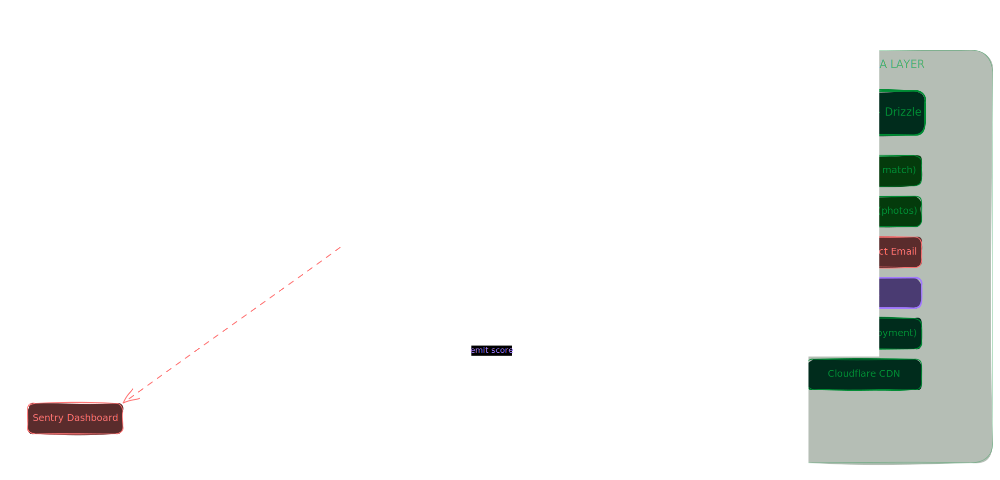

# EventBid

**Describe your event once, and let venues bid for it.**

EventBid is a two-sided marketplace for event venue booking. A **host** posts a
structured brief (event type, dates, headcount, location, budget, requirements);
the platform matches it to relevant **venues** using vector embeddings; venues
submit structured proposals; and the host compares them side by side — with AI
scoring and plain-English analysis — before locking a deal.

It replaces the WhatsApp-and-PDF chaos of venue hunting with one transparent
flow: **brief → matched venues → proposals → comparison → decision.**

## Core flow

1. **Host** creates a structured brief and publishes it.
2. The **matching engine** finds fitting venues — a hard gate (city, capacity,
   event type) plus a soft score (embedding similarity, requirement coverage,
   capacity fit) — and notifies them in-app and by email. Matching runs both
   ways, so a venue that joins later still picks up older open briefs.
3. **Venues** submit structured proposals (price, inclusions, amenities,
   confirmations) and can revise them — each revision is a new immutable version.
4. **AI** analyses each proposal against the brief (match score, sub-scores,
   summary, gaps) and writes a "how to win" guide for venues — generated once in
   the background and stored.
5. **Host** compares proposals side by side and **accepts one** — an atomic
   transaction locks that proposal, closes the rest, and closes the brief.

## Architecture



The backend follows an **adapter · service · repository** layering:

- **Repositories** are the only layer that touches Drizzle/SQL.
- **Services** hold business logic (matching, analysis, deal-lock, embeddings)
  via constructor-injected repositories and adapters.
- **Adapters** wrap every external dependency (AI, email, storage, queue,
  real-time) behind an interface, so providers are swappable without touching
  business logic.
- **Background jobs** (BullMQ) handle matching, AI analysis, venue embeddings,
  email, and a deadline cron; workers run inside the API process.
- **Real-time** updates stream to the browser over SSE; types are shared
  end-to-end from the Drizzle schema through `@eventbid/shared`.

## Monorepo layout

pnpm workspace monorepo:

```
eventbid/
├── apps/
│   ├── server/   # Hono API + BullMQ background workers
│   └── web/      # TanStack Start app (SSR frontend)
└── packages/
    ├── shared/   # @eventbid/shared — schema-derived types & Zod schemas
    ├── email/    # @eventbid/email — React Email templates
    └── logger/   # @eventbid/logger — shared logging
```

## Tech stack

| Layer | Choice |
|------|--------|
| Frontend | TanStack Start (Router + Query), React 19, Tailwind v4 |
| Backend | Hono (Node), TypeScript |
| Database | PostgreSQL + pgvector (HNSW), Drizzle ORM |
| Queue / cache | Redis via BullMQ |
| Auth | better-auth (email/password + Google) |
| AI | Vercel AI Gateway (generation + embeddings) |
| Email · Images | Resend + React Email · Cloudinary |

## Quick start

```bash
pnpm install

# Configure env for each app (see the .env.example files)
cp apps/server/.env.example apps/server/.env
cp apps/web/.env.example    apps/web/.env.local

# Start a local Redis (or point at a hosted one)
docker run -d --name eventbid-redis -p 6379:6379 redis:7

# Apply the schema (creates the pgvector extension + tables)
pnpm db:migrate

# Run web + server together
pnpm dev
```

- Web → http://localhost:3000
- API → http://localhost:4000

## Scripts (root)

| Command | Description |
|---------|-------------|
| `pnpm dev` | Run web + server in parallel (`dev:web` / `dev:server` for one). |
| `pnpm build` | Build all workspaces. |
| `pnpm typecheck` | Type-check all workspaces. |
| `pnpm db:generate` → `pnpm db:migrate` | Generate then apply a Drizzle migration. |
| `pnpm db:push` / `pnpm db:studio` | Push schema directly (dev) / open Drizzle Studio. |

## Prerequisites

Node ≥ 20 · pnpm ≥ 10 · PostgreSQL with pgvector · Redis (TCP — e.g. local
Docker or Upstash). For production, Neon (Postgres) + Upstash (Redis) work with
no code changes; the embedding column is `vector(1536)`.
